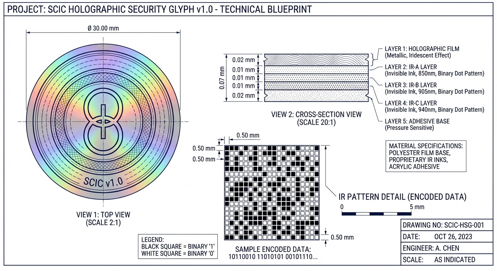

# Formato Físico do Glyph SCIC

**Versão Pública** | **Data:** 2025-11-28

---

## 📐 Especificações Gerais

### **Formato: Circular**

- **Diâmetro:** 30mm (3.0cm)
- **Espessura:** 0.07mm (70 microns)
- **Peso:** < 0.3g
- **Material Base:** Filme PET metalizado

---

## 🎨 Desenho Técnico



---

## 🔬 Estrutura em Camadas

O Glyph SCIC é composto por 5 camadas sobrepostas:

```
┌─────────────────────────────────────────┐
│  CAMADA 1: Holograma 3D                 │  ← 0.02mm
│  Função: Visual + Segurança             │
│  Efeito: Iridescente (color-shifting)   │
└─────────────────────────────────────────┘
              ↓
┌─────────────────────────────────────────┐
│  CAMADA 2: IR-A (850nm)                 │  ← 0.01mm
│  Função: IDENTIDADE                     │
│  Capacidade: 200 bytes                  │
└─────────────────────────────────────────┘
              ↓
┌─────────────────────────────────────────┐
│  CAMADA 3: IR-B (905nm)                 │  ← 0.01mm
│  Função: AÇÃO/COMANDO                   │
│  Capacidade: 200 bytes                  │
└─────────────────────────────────────────┘
              ↓
┌─────────────────────────────────────────┐
│  CAMADA 4: IR-C (940nm)                 │  ← 0.01mm
│  Função: GOVERNANÇA/AUDITORIA           │
│  Capacidade: 200 bytes                  │
└─────────────────────────────────────────┘
              ↓
┌─────────────────────────────────────────┐
│  CAMADA 5: Adesivo                      │  ← 0.02mm
│  Função: Fixação                        │
│  Tipo: Permanente (tamper-evident)      │
└─────────────────────────────────────────┘

Espessura Total: 0.07mm
Capacidade Total: 600 bytes (3 camadas IR)
```

---

## 📊 Padrão de Dados IR

### **Matriz Binária Espacial:**

Cada camada IR utiliza uma matriz de 40x40 células:

- **Grid:** 40 células × 40 células = 1600 células
- **Tamanho de célula:** 0.5mm × 0.5mm
- **Área de dados:** 20mm × 20mm (centro do glyph)
- **Encoding:** Binário espacial (célula preta = 1, branca = 0)

```
Exemplo de padrão (8x8 células):

▓ ░ ░ ▓ ▓ ░ ▓ ░   →  1 0 0 1 1 0 1 0
░ ▓ ▓ ░ ░ ▓ ░ ▓   →  0 1 1 0 0 1 0 1
▓ ░ ▓ ░ ▓ ░ ░ ▓   →  1 0 1 0 1 0 0 1
...

▓ = Tinta IR (bit 1)
░ = Sem tinta (bit 0)
```

---

## 🎨 Design Visual

### **Elementos Holográficos:**

- **Símbolo Central:** Representação da "Society of Mind" (Minsky)
- **Efeito Color-Shifting:** Azul → Verde → Dourado (muda com ângulo)
- **Microtext:** "SCIC AUTHENTIC" (< 0.1mm)
- **Padrões de Difração:** Únicos e não replicáveis

---

## 🔢 Estrutura de Dados

### **IR-A (850nm) - Identidade:**
```json
{
  "glyph_id": "GX-0001",
  "version": "1.0",
  "created": "2025-11-28",
  "hash": "a3f5b8c2...",
  "type": "identity"
}
```

### **IR-B (905nm) - Ação:**
```json
{
  "action": "authenticate",
  "permissions": ["access_A", "lab_3"],
  "level": 5,
  "valid_until": "2026-12-31"
}
```

### **IR-C (940nm) - Governança:**
```json
{
  "blockchain_hash": "0x7d8f3a2b...",
  "last_read": "2025-11-28T16:00:00Z",
  "read_count": 42,
  "status": "active"
}
```

---

## 📦 Leitura do Glyph

### **Equipamento Necessário:**

- Câmera IR multi-espectral (850/905/940nm)
- Resolução mínima: 720p
- Iluminação: LEDs IR correspondentes

### **Processo:**

1. Capturar imagem IR em cada wavelength
2. Detectar glyph circular
3. Extrair matriz 40x40
4. Decodificar binário → dados
5. Verificar blockchain
6. Ativar agente correspondente

**Tempo de leitura:** < 2 segundos

---

## 🎯 Casos de Uso

### **GuardDrive (Veículos):**
- Formato: Ø 40mm
- Aplicação: Placa do veículo
- Dados: VIN, manutenção, proprietário

### **GuardPass (Identidade):**
- Formato: Ø 25mm
- Aplicação: Crachá corporativo
- Dados: ID, permissões, validade

### **Supply Chain (Produtos):**
- Formato: Ø 20mm
- Aplicação: Embalagem
- Dados: Fabricante, lote, certificações

---

## ⚠️ Nota sobre Implementação

Detalhes específicos de fabricação, fornecedores, custos e processos de produção são proprietários e não divulgados publicamente.

Para informações sobre licenciamento comercial, consulte [PATENT_CONFORMANCE.md](PATENT_CONFORMANCE.md).

---

**Última Atualização:** 2025-11-28  
**Versão:** 1.0 (Pública)
