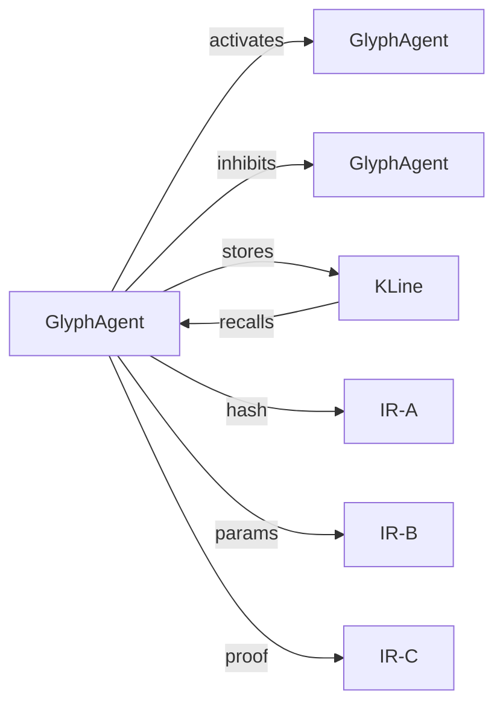

# MVP – Marco de Lançamento do NeoSigm Genesis

## Visão Geral
Este MVP demonstra a **Arquitetura Minskyana** aplicada à **Semiografia Cibernética (SCIC)**, integrando:
- **GlyphAgents** – agentes ativos com estado interno.
- **K‑Lines** – memória cognitiva que captura e restaura estados.
- **Camadas IR** (IR‑A identidade, IR‑B ação, IR‑C governança) para segurança e auditoria.
- **Frontend** com visualização em tempo real da sociedade de glifos.

## Contribuições Técnicas
| Área | Implementação | Impacto |
|------|---------------|---------|
| **Backend** | `src/backend/modules/society_of_glyphs.py`, `k_line_memory.py`, `app.py` | Agentes, memória, geração de SVG e hash canônico. |
| **Frontend** | `src/frontend/index.html`, `css/style.css`, `js/app.js` | Canvas interativo que exibe a rede de agentes e seus níveis de ativação. |
| **Demo** | `src/backend/demo_society.py` | Simulação de ativação, inibição e recall de memória. |
| **Prova Visual** | GIF `assets/society_evolution.gif` | Evidência de funcionamento dinâmico. |

## Correspondência com a Patente
> **Reivindicação ↔ Implementação**

| Reivindicação da Patente | Implementação no Código | Como a Implementação Cumpre |
|---------------------------|--------------------------|----------------------------|
| **Símbolo Ativo** (Active Symbol) | `GlyphAgent` (classe em `society_of_glyphs.py`) | Cada agente possui `self.state` e método `activate`/`inhibit`. |
| **Memória Cognitiva** (Cognitive Memory) | `KLineMemorySystem` e `KLine` (`k_line_memory.py`) | Captura o estado completo de um agente e permite `recall`. |
| **Segurança em Camadas** (Dual‑Layer Security) | `generate_canonical_data` em `app.py` | Calcula hash SHA‑256 sobre JSON canônico + SVG normalizado (IR‑A). |
| **Arquitetura Social** (Society of Mind) | `create_genesis_society` e `demo_society.py` | Rede de agentes com conexões excitatórias e inibitórias (Cross‑Exclusion). |
| **Auditoria Imutável** (Proof of Genesis) | `register_glyph_on_chain` (blockchain_module) | Gera token NFT contendo hash canônico, data e assinatura. |
| **Camadas IR** | Campos `id`, `hash` (IR‑A); parâmetros `primitives`, `params` (IR‑B); `blockchain_proof` (IR‑C) | Cada camada está representada em `canonical_data` e no SVG. |

### Diagrama de Relacionamento (Mermaid)

## Demonstração
1. Inicie o backend (`venv\Scripts\python src/backend/app.py`).
2. Abra `http://127.0.0.1:5000` no navegador.
3. Gere um glifo e observe a visualização da sociedade.
4. O GIF `assets/society_evolution.gif` captura a evolução (ativação → inibição → recall).

## Próximos Passos
- Publicar a API como serviço RESTful.
- Implementar aprendizado Hebbiano para reforçar conexões.
- Expandir o conjunto de glifos (GX‑0013+).
- Finalizar documentação de submissão de patente (desenhos, reivindicações, provas).
